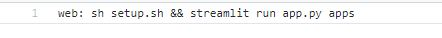

# [Streamlit Dashboard](https://liverpooldashboard.herokuapp.com/)

## Setup: 
1. Procfile

2. [app.py](https://github.com/Jaspreetsm21/Liverpool_title_run/blob/master/app.py) 

Streamlit python script for the dashboard 

3. Setup.sh

4. requirements

