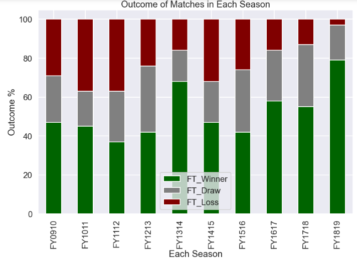
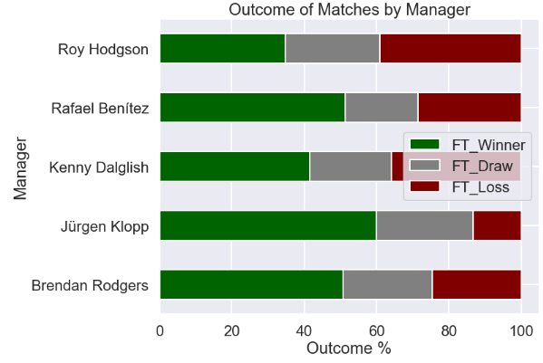
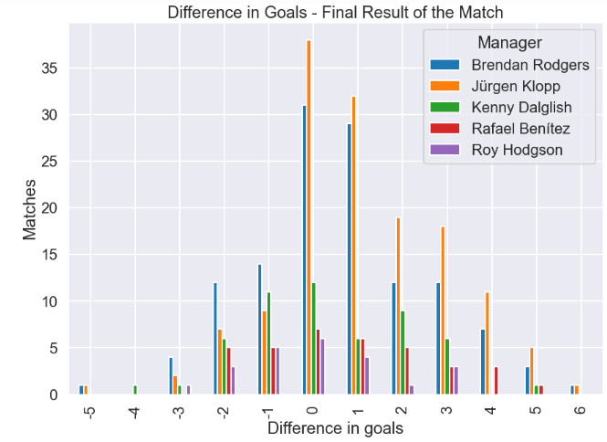
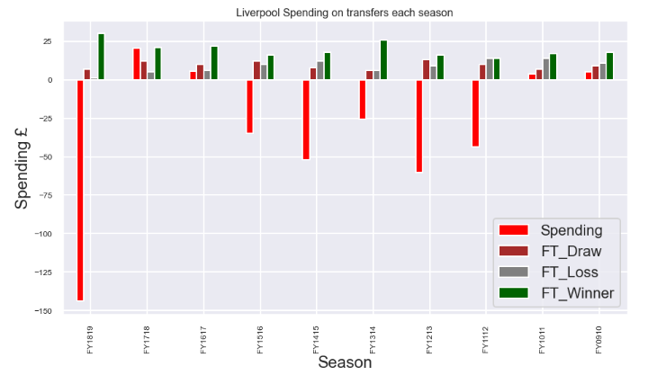
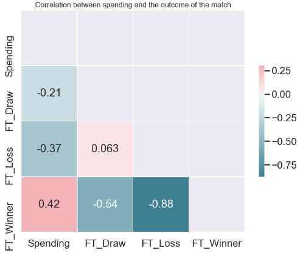

# Liverpool's Title Run in 30 Year: Data Science Project Overview

- Created a tool that estimates car prices (MAE ~ £1539) to help car owners/buyers to negotiate the deal. 
- Scraped over 8000 car listing from auto trader using python and beautifulsoup
- Optimized Linear, Lasso, Decision Tree and Random Forest Regressors using GridsearchCV to reach the best model.

# Code and Resources Used

**Python Version**: 3.7

**Packages**: pandas, numpy, sklearn, matplotlib, seaborn,json

**Data Resource**: https://www.football-data.co.uk/englandm.php
# Data Cleaning
After scraping the data, I needed to clean it up so that it was usable for our model. I made the following changes and created the following variables:

- Dealing with Missing Values

- It looks like we have scraped some data that imported into wrong columns. So I'm going to filter the data for Petrol, Diesel and Hybrid cars only.

- creating a new column called Car_Make - that we extracted from Car_Title Column

- Converting Car_Price and Car_Mileage into Numeric Values - before that I'm going to remove £ sign and comma from each of the columns

# EDA

 

 

**Insight**

Average Car Prices are around £12,000 

75% of cars has mileage less than 53,000 miles.

28,000 is the average car mileage

Negative Correlation make sense as car mileage goes up the car prices comes down.

Hybrid cars are clearly more expensive than petrol and Diesel cars.

On Average Hybrid Cars are £1,500 more expensive than petrol cars. The reason could be Hybrid cars were introduced in early 2000s and its still growing in its popularity as environmental crisis are widely discussed.

On Average Automatic cars are £1,500 more expensive than Manual.

Ford is the most listed car on AutoTrader and also it is most common car sold in UK.

It is interesting to see most cars listed on Auto traders shows that 2.0L producing more Automatic Cars compare to any other engine size which is mainly dominated by manual cars.

# [Streamlit Dashboard](https://liverpooldashboard.herokuapp.com/)

## Setup: 
1. Procfile

2. [app.py](https://github.com/Jaspreetsm21/Liverpool_title_run/blob/master/app.py) 

Streamlit python script for the dashboard 

3. Setup.sh

4. requirements

