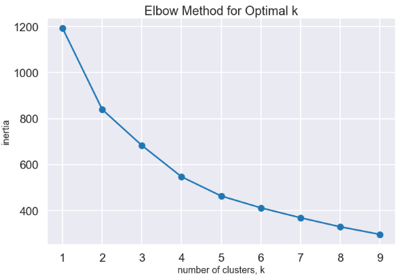
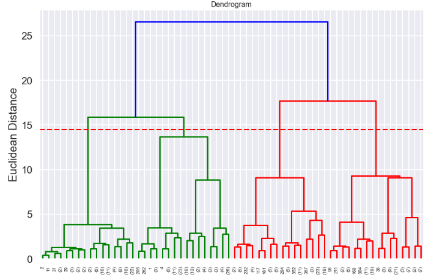

# Liverpool's Title Run in 30 Year: Cluster Analysis - Data Science Project Overview 

- Created a tool that estimates car prices (MAE ~ £1539) to help car owners/buyers to negotiate the deal. 
- Scraped over 8000 car listing from auto trader using python and beautifulsoup
- Optimized Linear, Lasso, Decision Tree and Random Forest Regressors using GridsearchCV to reach the best model.

# Code and Resources Used

**Python Version**: 3.7

**Packages**: pandas, numpy, sklearn, matplotlib, seaborn,json

**Data Resource**: https://www.football-data.co.uk/englandm.php
# Data Cleaning
After scraping the data, I needed to clean it up so that it was usable for our model. I made the following changes and created the following variables:

- Dealing with Missing Values

- It looks like we have scraped some data that imported into wrong columns. So I'm going to filter the data for Petrol, Diesel and Hybrid cars only.

- creating a new column called Car_Make - that we extracted from Car_Title Column

- Converting Car_Price and Car_Mileage into Numeric Values - before that I'm going to remove £ sign and comma from each of the columns

# EDA

 

 

**Insight**

- The first half of the decade Liverpool had more loss compared to draw and second half of the decade it converted loss into draws, which has resulted in more winners last season.

- In the Last 10 Year, Liverpool have won over 50% of their games however the ratio of Draw and losses are pretty similar.

- Under Kloop the average target shot for both Home and away matches are lowest among his peers however he still has more wins compare to other managers. 

- Jürgen Klopp has a distribution toward right hand side, he has the most draws and majority of this winners are difference of 1 or 2 goals.

- Liverpool has more shots taken at Home(HS) and which correlates with shots on target at home matches (HST).So, we can say that liverpool win more matches at home because they take more shots and hit the target.

- From the graph above, Liverpool has spend on average £43.5M in transfer each season between 2011-2016 and last season liverpool spend £143M - Buying a new goalkeeper for £56M. The Correlation between transfers and winning can be seen through each season - more spending has resulted in more wins.

# Cluster Analysis 

# [Streamlit Dashboard](https://liverpooldashboard.herokuapp.com/)

## Setup: 
1. Procfile

2. [app.py](https://github.com/Jaspreetsm21/Liverpool_title_run/blob/master/app.py) 

Streamlit python script for the dashboard 

3. Setup.sh

4. requirements

